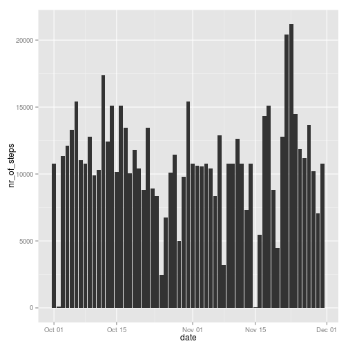

# Reproducible Research: Peer Assessment 1


## Loading and preprocessing the data


```r
unzip("activity.zip")
data <- read.csv("activity.csv", stringsAsFactors = FALSE)
data$date <- as.Date(data$date)
```

## What is mean total number of steps taken per day?


```r
steps_per_day <- aggregate(data$steps, list(data$date), sum)
names(steps_per_day) <- c("date","nr_of_steps")
library(ggplot2)
ggplot(steps_per_day, aes(date,nr_of_steps)) + geom_bar(stat="identity")
```

```
## Warning: Removed 8 rows containing missing values (position_stack).
```

 

```r
mean(steps_per_day$nr_of_steps, na.rm=TRUE)
```

```
## [1] 10766
```

```r
median(steps_per_day$nr_of_steps, na.rm=TRUE)
```

```
## [1] 10765
```


## What is the average daily activity pattern?


```r
agg <- aggregate(data$steps, by=list(data$interval), mean, na.rm=TRUE)
names(agg) <- c("interval", "Avg_Steps")
ggplot() + geom_line(data = data, aes(x=data$interval, y=data$steps)) + geom_point(data = agg, aes(x=agg$interval,y=agg$Avg_Steps))
```

```
## Warning: Removed 2 rows containing missing values (geom_path).
```

 

### The interval with the maximum average of nr of steps over all days:

```r
agg[max(agg$Avg_Steps), ]
```

```
##     interval Avg_Steps
## 206     1705      56.3
```

## Imputing missing values
### number of rows with missing information for number of steps:

```r
nrow(data[is.na(data$steps), ])
```

```
## [1] 2304
```

### replace the NA values with the mean of the interval over all days

```r
data.nomissing <- data
data.nomissing[is.na(data.nomissing$steps), ]$steps <- agg[match(data.nomissing[is.na(data.nomissing$steps), ]$interval, agg$interval), ]$Avg_Steps
nrow(data.nomissing[is.na(data.nomissing$steps), ])
```

```
## [1] 0
```

### total number of steps taken each day 


```r
steps_per_day.nomissing <- aggregate(data.nomissing$steps, list(data.nomissing$date), sum)
names(steps_per_day.nomissing) <- c("date","nr_of_steps")
library(ggplot2)
ggplot(steps_per_day.nomissing, aes(date,nr_of_steps)) + geom_bar(stat="identity")
```

 

### the mean and median total number of steps taken per day


```r
mean(steps_per_day.nomissing$nr_of_steps)
```

```
## [1] 10766
```

```r
median(steps_per_day.nomissing$nr_of_steps)
```

```
## [1] 10766
```

## Are there differences in activity patterns between weekdays and weekends?


```r
data.nomissing$day <- weekdays(data.nomissing$date)
weekends <- data.nomissing[data.nomissing$day == "Sunday" | data.nomissing$day == "Saterday",  ]
weekdays <- data.nomissing[data.nomissing$day != "Sunday" & data.nomissing$day != "Saterday",  ]
agg.weekends <- aggregate(weekends$steps, by=list(weekends$interval), mean, na.rm=TRUE)
names(agg.weekends) <- c("interval", "Avg_Steps")
agg.weekends$day_of_week <- as.factor("weekend")
agg.weekdays <- aggregate(weekdays$steps, by=list(weekdays$interval), mean, na.rm=TRUE)
names(agg.weekdays) <- c("interval", "Avg_Steps")
agg.weekdays$day_of_week <- as.factor("weekday")
agg <- rbind(agg.weekends, agg.weekdays)
ggplot() + geom_line(data = agg, aes(x=interval,y=Avg_Steps)) + facet_grid(day_of_week ~ .)
```

 
